# Sentinel AI — System Anatomy (V1)

**Operations intelligence over the tools you already use.**

Work happens across a dozen disconnected services. The signals that predict a
missed deadline, a stalled review or a dropped conversation already exist in
that data — nobody has time to connect them. Sentinel watches the services you
connect, correlates what it finds, and tells you what needs you and why.

> This document describes the **current V1 codebase**. Every number and every
> arrow was verified against the source. Anything not established from the code
> is explicitly marked **NOT CONFIRMED FROM CODE**.

**V1 at a glance:** 12 providers · 12 signal types · 22 deterministic detectors ·
20 attention types · 40 registry actions (38 available, all 38 verified, 32
undoable) · 20 LLM call sites · 902 backend tests.

---

## Table of contents

1. [Master system diagram](#1-master-system-diagram)
2. [Provider → Signal pipeline](#2-provider--signal-pipeline)
3. [Intelligence Core](#3-intelligence-core)
4. [Correlation / Situations](#4-correlation--situations)
5. [Deterministic vs LLM](#5-deterministic-vs-llm)
6. [Assistant architecture](#6-assistant-architecture)
7. [Agentic Action architecture](#7-agentic-action-architecture)
8. [Personal vs Group](#8-personal-vs-group)
9. [Memory & Goals](#9-memory--goals)
10. [End-to-end examples](#10-end-to-end-examples)
11. [Tech stack](#11-tech-stack)
12. [Low-level data flow](#12-low-level-data-flow)
13. [Explaining Sentinel](#13-explaining-sentinel)
14. [Design principles](#14-design-principles)
15. [V1 limitations](#15-v1-limitations)

---

## 1. Master system diagram

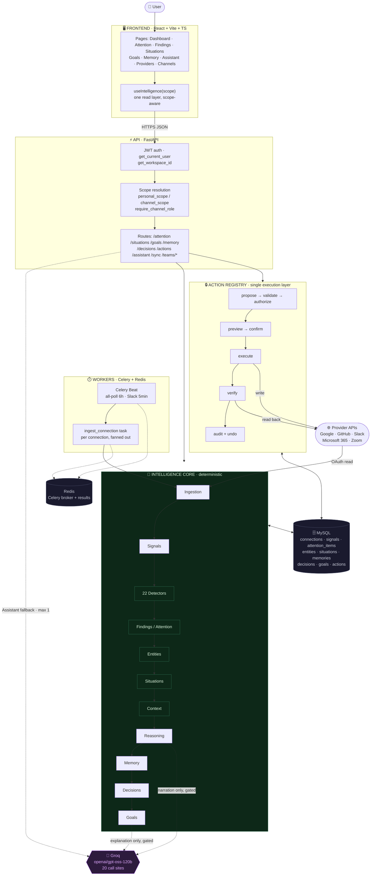

**Where the LLM is NOT used:** ingestion, all 22 detectors, entity extraction,
correlation, context assembly, priority scoring, memory recurrence/decay, goal
health, goal progress, decision generation, permissions, action validation,
execution, verification, audit.

**Where it IS used:** 20 call sites, all narration/explanation/NLU. See [§5](#5-deterministic-vs-llm).

---

## 2. Provider → Signal pipeline

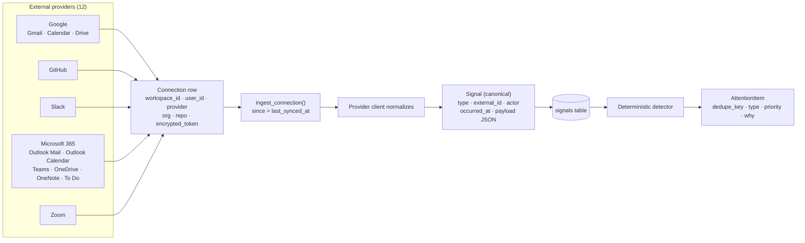

### The 12 signal types

| Signal type | Produced by |
|---|---|
| `pr`, `review_submitted`, `commit`, `issue` | GitHub |
| `calendar_event` | Google Calendar · Outlook Calendar · Zoom |
| `email` | Gmail · Outlook Mail |
| `drive_file` | Google Drive · OneDrive |
| `channel_activity`, `mention`, `flagged_message` | Slack · Microsoft Teams |
| `note` | OneNote |
| `task` | Microsoft To Do |

**Key properties:**
- `last_synced_at` doubles as the ingestion cursor — a failed sync never advances it.
- Upsert is keyed on `(connection_id, type, external_id)`, so re-ingestion is idempotent.
- Email/document **bodies are never stored.** Only metadata persists; a body is
  fetched live for one question and discarded.
- A connection with no resource chosen (`repo == ""`) is an *anchor* and ingests nothing.

---

## 3. Intelligence Core

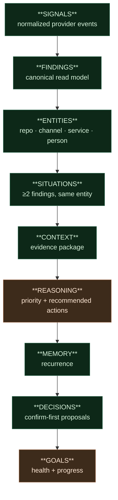
🟩 fully deterministic  🟫 deterministic + **optional** gated LLM narration

### Layer by layer

| Layer | Represents | Why it exists | Input | Output | LLM | Persists |
|---|---|---|---|---|---|---|
| **Signals** | A normalized provider event | One shape for every provider, so detectors don't know about APIs | Provider API | `Signal` rows | ❌ | ✅ `signals` |
| **Findings** | "Something an operator should know" | Attention items and proactive situations had different shapes; everything above needed one | Attention items + proactive situations | `Finding` read model | ❌ | ❌ *read model, no table* |
| **Entities** | The real thing a finding is about | Correlation needs a join key that isn't a string match | Findings | `Entity` + `EntityMention` | ❌ | ✅ `entities`, `entity_mentions` |
| **Situations** | ≥2 findings about the same entity | The product thesis: scattered facts are one story | Entity mentions | `Situation` | ❌ | ✅ `situations` |
| **Context** | The evidence a situation is built from | The LLM must never see raw data — only a prepared package | Situation + members | `SituationContext` | ❌ | ❌ *in-memory* |
| **Reasoning** | Priority + recommended actions | Ranking must be a sort over a number, not a model's opinion | `context.to_facts()` | `SituationReasoning` | ⚠️ *narration only, fingerprint-gated* | ✅ `situation_reasoning` |
| **Memory** | A pattern seen more than once | Recurrence is evidence; it should raise priority | Situations w/ `occurrence_count ≥ 2` | `Memory` | ❌ | ✅ `memories` |
| **Decisions** | A grounded, confirm-first proposal | A recommendation must trace to a finding kind | Reasoning + Memory | `Decision` | ❌ | ✅ `decisions` |
| **Goals** | A desired outcome + whether it'll happen | Everything else says "what is"; this says "will it" | Linked commitments + situations + deadline | `Goal` | ⚠️ *explanation only, fingerprint-gated* | ✅ `goals` |

**The invariant:** in Reasoning and Goals the LLM is handed a conclusion that is
already computed and asked to phrase it. `priority_score`, `health` and
`progress` are written by Python before any model is called.

---

## 4. Correlation / Situations

This is the mechanism that makes Sentinel more than a feed.

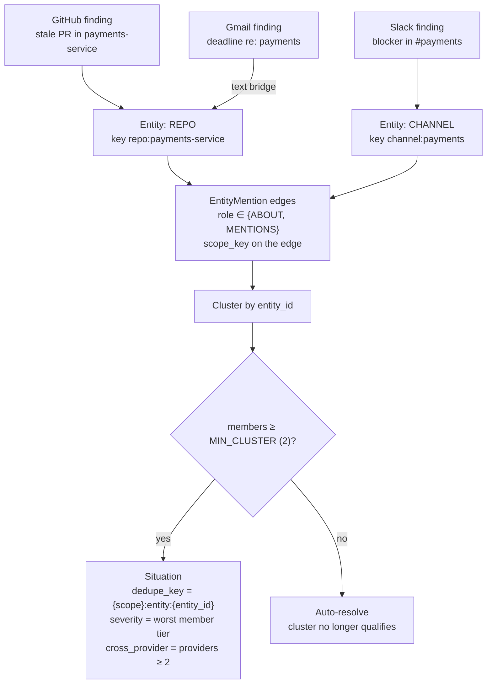

### How it actually works

**Two-pass entity extraction** (`entity_engine.extract_entities`):
1. **Structured provenance first** — a GitHub finding's connection *is* a repo, a
   Slack finding's channel *is* a channel, a service-jeopardy encodes its service
   in its key, an actor becomes a `PERSON`. Confidence `1.0`.
2. **Text bridge second** — remaining finding text is matched against the
   *already-known strong entities*. Never invents an entity from text.

**Only STRONG_KINDS correlate:** `REPO`, `CHANNEL`, `SERVICE`.
`PERSON` is extracted and stored but **deliberately excluded** — everyone shares
colleagues, so correlating on people would cluster everything with everything.

**Only ABOUT and MENTIONS roles** count toward a cluster (`ACTOR` does not).

**Threshold:** `MIN_CLUSTER = 2`. One finding is not a situation.

**Scope lives on the edge, not the entity.** A repo is one repo workspace-wide;
the *mention* carries `scope_key`. One scope can never disturb another's clusters.

**Auto-resolution is deterministic:** any open situation whose cluster no longer
qualifies is marked `RESOLVED`. Nothing needs a human to tidy up.

---

## 5. Deterministic vs LLM

```mermaid
flowchart TB
    S["SENTINEL"]
    S --> DET["🟩 DETERMINISTIC · no LLM"]
    S --> LLM["🟪 LLM · Groq"]

    DET --> D1["22 detectors"]
    DET --> D2["Entity extraction + correlation"]
    DET --> D3["Priority · severity · tier"]
    DET --> D4["Goal health + progress"]
    DET --> D5["Memory recurrence + decay"]
    DET --> D6["Decision generation"]
    DET --> D7["Scope · RBAC · authorization"]
    DET --> D8["Action validate · execute · verify · audit"]
    DET --> D9["Assistant intent routing + target resolution"]
    DET --> D10["Week-over-week trends"]

    LLM --> L1["reasoning_engine · situation narration<br/>gated: evidence_fingerprint"]
    LLM --> L2["goals · assessment + next_step<br/>gated: state_fingerprint"]
    LLM --> L3["proactive · situation synthesis<br/>gated: evidence_fingerprint"]
    LLM --> L4["catchup · delta narration<br/>gated: ≥12h since last seen"]
    LLM --> L5["meeting_prep · brief<br/>cached per event"]
    LLM --> L6["channel_briefing · narration<br/>gated: content fingerprint"]
    LLM --> L7["investigation · 4 anchors<br/>cached per item+scope"]
    LLM --> L8["action_intent · text → action key<br/>NLU, no cache possible"]
    LLM --> L9["assistant/chat · grounded fallback"]
    LLM --> L10["orchestrator · provider AI panels<br/>multi-step, user-invoked"]
    LLM --> L11["legacy agents · 4 remaining"]
    LLM --> L12["mail_summarizer · on demand"]

    style DET fill:#0d2818,stroke:#2d6a4f,color:#d8f3dc
    style LLM fill:#2d1b3d,stroke:#7b2cbf,color:#e0aaff
```

### What MUST remain deterministic — and why

| Must be deterministic | Failure mode if it weren't |
|---|---|
| Detection | A hallucinated finding sends someone chasing nothing |
| Priority/severity | A model could talk itself up the list |
| Goal health/progress | A confident "73%" nobody can trace is worse than no number |
| Memory recurrence | A remembered pattern that never happened is a false memory |
| Scope / RBAC | Prompt injection becomes privilege escalation |
| Action validation & execution | Whatever the model can phrase, it could attempt |
| Verification | "It worked" would be a claim, not a check |

### How the gates work

**Fingerprint gating** — a hash of the *inputs the narration derives from*:

```
proactive        evidence_fingerprint  = sha256(sorted signal_ids)
reasoning        only situations whose context changed
goals            state_fingerprint     = sha256(health|progress|reasons)
channel_briefing sha256(visible item ids + titles + due dates + labels)
```

If the fingerprint matches, the stored narrative is reused and **no call is made**.
A workspace where nothing changed costs **zero tokens**, no matter how often it syncs.

**Caching** — `meeting_prep` caches per `event_external_id`; `investigation`
caches per `(item, scope_key)`. Both re-run only on explicit `?refresh=true`.

**Failure is always graceful.** Every `complete_json` caller has a deterministic
fallback: the evidence stands without prose. A `429`/`413` raises
`LLMOverloadedError` and the feature degrades in charm, never in correctness.

### Assistant budget

`LLM_BUDGET: Record<Intent, 0 | 1>` is **exhaustive over the intent type** — a
new intent cannot be added without choosing a budget — and is asserted at runtime.

| Budget | Intents |
|---|---|
| **0** | `attention` · `findings` · `situations` · `goals` · `decisions` · `status` · `memory` · `investigate` · `search` · `provider` · `resolve` · `bulk` · `remember` |
| **1** | `catchup` · `prepare` · `action` · `ask` |

**Measured: 4 LLM calls across 17 representative questions.**
**Maximum for a normal request: 1. Never a chain.**

### Legacy LLM paths remaining

4 detectors in the LangGraph agents: `contributor_drops`, `risky_deploys`
(engineering), `stale_flagged_mail`, `spam_surge` (communication). Two others —
`review_bottleneck` and `calendar_overload` — were **retired** once deterministic
equivalents existed; the methods are kept callable so the decision is reversible.
The whole pass is gated on new signals arriving.

---

## 6. Assistant architecture

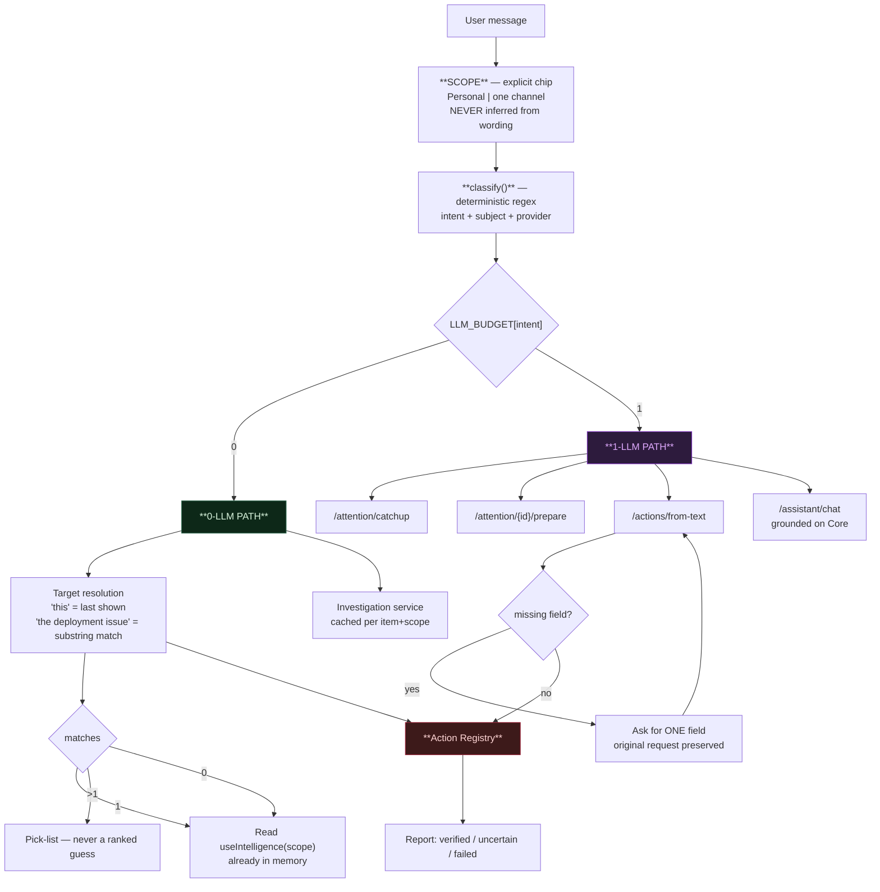

**Where an LLM can enter:** exactly four points — `catchup`, `prepare`, `action`,
`ask`. Nowhere else. Routing, scope, target resolution and rendering are all
deterministic.

| Capability | How |
|---|---|
| **Deterministic intents** | Ordered regex, most-specific first; first match wins |
| **Target resolution** | Last block that showed items → substring match → exact-title tiebreak |
| **Ambiguity** | Pick-list. Never a confidence ranking — a wrong action on the wrong item isn't a mistake a score should make |
| **Slot filling** | Missing field read from the **server's own validation error**, not a duplicated client schema. Original request carried forward |
| **Investigation** | Real `investigation` service, cached per item+scope — re-asking "why" is free |
| **Bulk** | Closed selector vocabulary → full preview → confirm → one registry call per item → per-item report |
| **Confirmation** | The **server** decides via `needs_approval`; the client never skips it |
| **Failure** | Optimistic drop is reverted; `UNKNOWN` reported as "applied but unconfirmed", never as success or failure |
| **Personal vs Group** | Scope chip swaps the endpoints; server re-checks membership on every channel route |

---

## 7. Agentic Action architecture

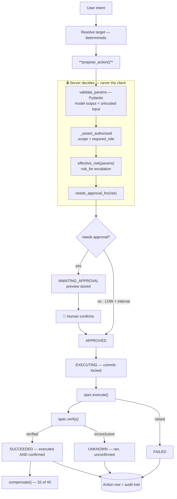

### Why the LLM may never execute directly

> A model that can call provider APIs decides its own permissions: **whatever it
> can phrase, it can attempt.** Here it can only name a key that already exists
> in the registry and supply parameters a Pydantic schema then has to accept.

`action_intent` returns a **proposal**. It has no execution path at all. The
worst a prompt-injected email can achieve is *proposing* something the user then
sees, previewed, and declines.

### V1 registry facts

| | |
|---|---|
| Registered actions | **40** |
| Available | **38** (`email.send` and `github.create_issue` declared, deliberately unavailable) |
| With a verifier | **38 / 38** available |
| With real undo | **32** |
| Auto-approved | **13** — every one LOW risk, internal (no provider call) and reversible.<br/>Sentinel-internal state only: attention done/dismiss/snooze, goal create/achieve/abandon/reopen,<br/>commitment create/resolve, memory forget, decision confirm/dismiss, email draft |
| Autonomy-eligible | **2**, and **nothing runs unattended** |

**Coverage:** Outlook (8) · To Do (4) · OneDrive (5) · OneNote (4) · Zoom (3) ·
Google (2) · Sentinel-internal (14: attention, commitment, goal, memory, decision).

**Safety properties:** idempotency key prevents duplicates; `EXECUTING` is
committed *before* the attempt so a concurrent call finds a non-approved status;
`risk_for` escalates a calendar event to HIGH the moment attendees are added
(a private write becomes an outbound message); actions with no genuine inverse
are marked IRREVERSIBLE rather than offered a button that cannot work.

---

## 8. Personal vs Group

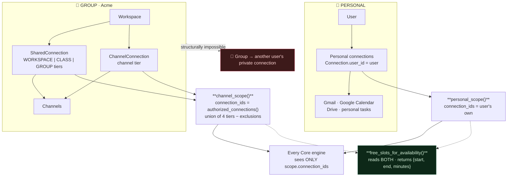

### How enforcement actually works

`Scope` (`app/domain/scope.py`) is the universal parameter of the Core:

```python
@dataclass
class Scope:
    key: str                      # "personal:{user_id}" | "channel:{team_id}"
    connection_ids: set[UUID]     # the ONLY data this run may read
    workspace_id: UUID | None
    owner_id: UUID | None
```

An engine only ever sees `scope.connection_ids`. A channel scope never contains
a personal connection, so a channel run **structurally cannot** read personal
data — this is a property of the data, not a filter someone remembered to write.

**Fail-closed everywhere:** connecting a service shares it nowhere by itself.
An empty `connection_ids` means "none", never "all". An attention item with no
recorded `connection_id` belongs to nobody and is invisible and unwritable.

**Reads and writes share one rule.** `owns_attention_item()` is defined beside
the read filter it mirrors, so a write can never be authorized more loosely than
the read that revealed the item.

### Combine without exposing

Sentinel *may* combine authorized personal availability with group data to make
a better decision. The guarantee that it does not disclose the private half is
**structural, not promised**:

```python
free_slots_for_availability(...) -> [{"start": ..., "end": ..., "minutes": ...}]
```

No title. No attendee. No organiser. No owner. It can say *"3 PM is
unavailable"* and **physically cannot** say whose appointment that is.

---

## 9. Memory & Goals

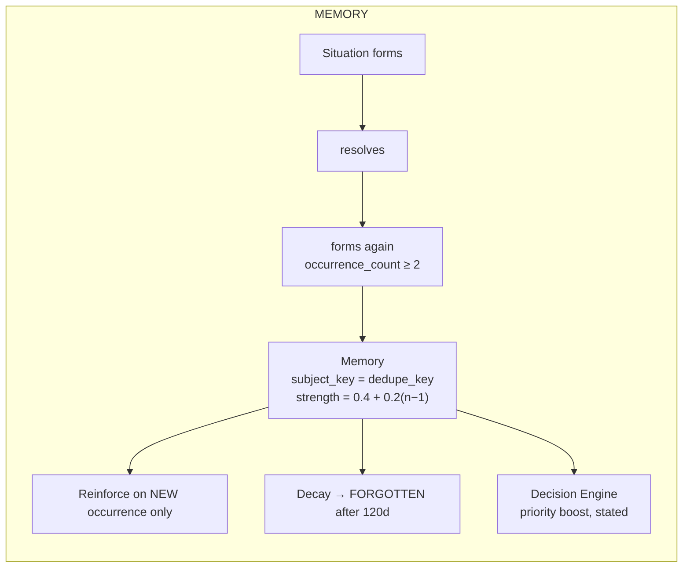

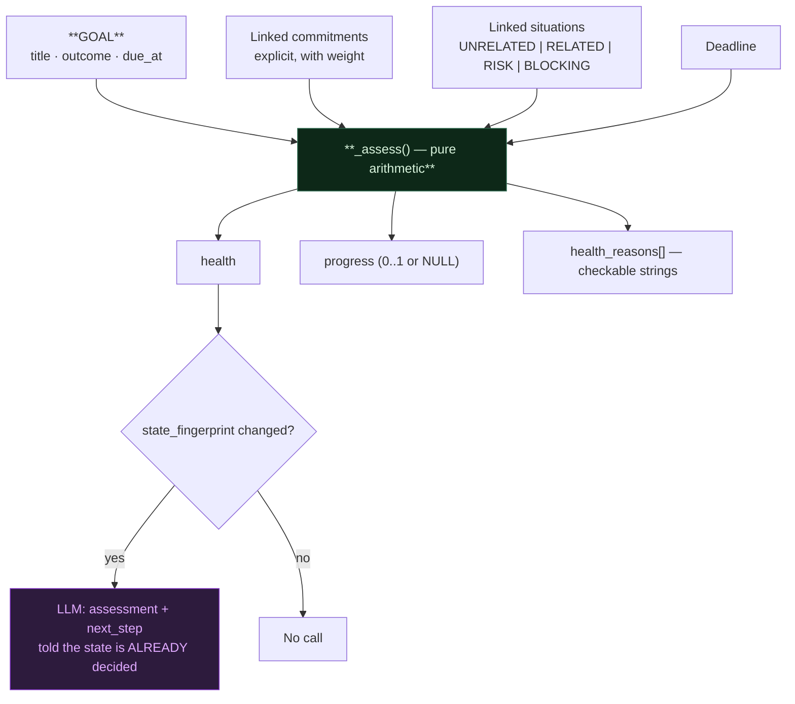

### The critical rule

> **The LLM does not decide goal health or progress.** They are computed from
> linked commitments and the deadline by `services/goals.py`. The model is
> allowed to *explain* the resulting state and never to decide it.

- **Links are explicit.** A commitment counts because a person linked it — never
  keyword similarity. A single wrong link would silently move a team's launch to
  BLOCKED.
- **A situation must be classified `RISK` or `BLOCKING`** to move health.
  `UNRELATED` is the default, and that default is the point: before it, every
  active situation in a scope affected every goal, so a busy channel marked
  unrelated goals at risk and "at risk" stopped meaning anything.
- **`progress = NULL` when nothing is linked.** The UI says "cannot yet be
  determined" rather than showing a confident 0%.
- Reasons are plain strings a person can check: *"2 commitments are overdue and
  putting this goal at risk."*

---

## 10. End-to-end examples

### Example 1 — Engineering

```mermaid
flowchart LR
    A["GitHub sync<br/>pr signal, 5 open PRs<br/>requested_reviewers: alice"] --> B["_detect_review_bottleneck<br/>🟩 0 LLM"]
    B --> C["AttentionItem<br/>REVIEW_BOTTLENECK<br/>'5 pull requests waiting on alice'"]
    C --> D["Entity REPO:api"]
    D --> E{"≥2 findings<br/>same entity?"}
    E -->|yes, with stale_pr| F["Situation"]
    F --> G["Reasoning<br/>priority + 'Spread the review load'"]
    G --> H["Decision — confirm-first"]
    H --> I["Assistant: 'What's urgent?'<br/>🟩 0 LLM"]
    I --> J["'Mark this done' → attention.done"]
    J --> K["Registry: execute → verify"]
    K --> L["'Verified · View activity'"]
```

### Example 2 — Meeting

```mermaid
flowchart LR
    A["Calendar sync<br/>two calendar_event signals<br/>15:00–16:00 and 15:30–16:30"] --> B["_detect_meeting_conflicts<br/>🟩 overlap arithmetic"]
    B --> C["AttentionItem MEETING_CONFLICT<br/>'30 minute overlap'"]
    C --> D["Assistant: 'Prepare me for my next meeting'"]
    D --> E["/attention/{id}/prepare<br/>🟪 1 LLM · cached per event"]
    E --> F["Brief: attendees → emails → docs → prior meetings"]
    F --> G["'Schedule a follow-up' → action_intent<br/>🟪 1 LLM → proposal only"]
    G --> H["risk_for: attendees ⇒ HIGH<br/>👤 explicit confirm"]
    H --> I["calendar.create_event → Google"]
    I --> J["verify: get_event() reads it back"]
    J --> K["SUCCEEDED + compensatable undo"]
```

### Example 3 — Cross-provider

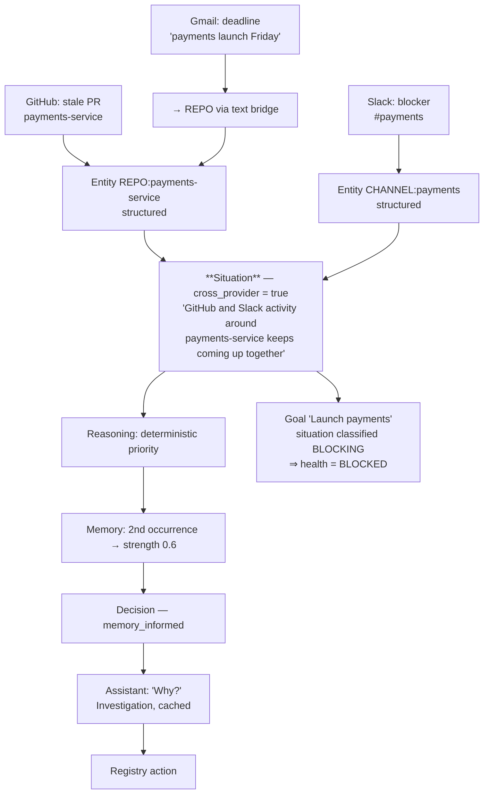

---

## 11. Tech stack

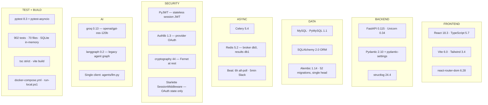

> **NOT CONFIRMED FROM CODE:** there is no CI workflow, no hosted deployment
> config beyond `docker-compose.yml`, and no ESLint flat config (the installed
> ESLint expects one). No lint step runs in V1.

---

## 12. Low-level data flow

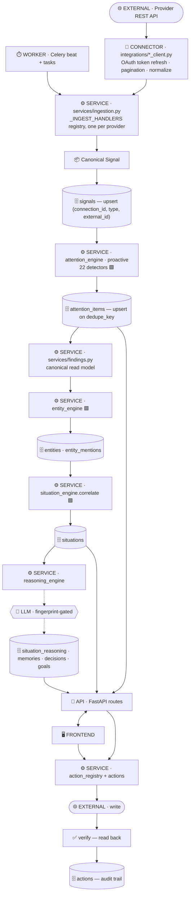

**Boundary legend:** `🖥️ Frontend` · `🔀 API` · `⚙️ Service` · `🗄️ Database` ·
`⏱️ Worker` · `🌐 External Provider` · `🤖 LLM`

**Two entry points into the pipeline:**
1. **Scheduled** — Celery Beat → `ingest_connection` per connection.
2. **On demand** — `POST /sync` → `run_full_sync` runs the *same functions in the
   same order*, synchronously, so the caller gets a real completion signal.

---

## 13. Explaining Sentinel

### Level 1 — 30 seconds (non-technical)

> Your work is scattered across email, calendar, chat and code tools. Each one
> shows you its own corner, and the things that actually go wrong — a decision
> waiting on a reply, a deadline nobody linked to the work — live *between*
> them, where nothing is looking.
>
> Sentinel connects to the tools you already use and watches for those. When
> several unrelated-looking things turn out to be about the same project, it
> tells you they're connected, why it matters, and what to do — and it can do
> the small things for you, once you say yes.

### Level 2 — 2 minutes (product + pipeline)

> Sentinel connects to 12 services and turns everything into one shape called a
> **Signal**. About 22 detectors — plain rules, no AI — read those signals and
> produce **Findings**: a stale pull request, a meeting double-booked, a
> conversation nobody replied to.
>
> The interesting part is next. Sentinel works out what each finding is *about* —
> a repository, a channel, a service — and when **two or more findings point at
> the same thing**, it groups them into a **Situation**. That's the bit no single
> tool can do, because no single tool can see the others.
>
> Above that: **Memory** notices when a situation keeps coming back and raises its
> priority. **Decisions** propose what to do. **Goals** track whether an outcome
> is actually going to happen, with health computed from real linked work.
>
> You talk to all of it through the **Assistant**. Ask "what's urgent?" and it
> answers instantly from data it already has — **no AI call at all**. Ask it to
> do something and it proposes an action you confirm; Sentinel then executes it,
> **reads the result back to check it worked**, and records what happened.
>
> The rule underneath: **the computer decides, the AI only explains.** Severity,
> priority and progress are arithmetic. The model is handed the answer and asked
> to put it in a sentence. That's why every verdict comes with reasons you can
> check.

### Level 3 — 10 minutes (technical)

**Ingestion.** 12 providers behind one `_INGEST_HANDLERS` registry — adding a
provider is one registration, not another `elif`. Each normalizes to a `Signal`
with `type`, `external_id`, `actor`, `occurred_at` and a JSON payload. Upsert is
keyed on `(connection_id, type, external_id)`, so re-ingestion is idempotent.
`last_synced_at` doubles as the cursor and never advances past a failed sync.
**Bodies are never persisted** — metadata only; a body is fetched live for one
question and discarded.

**Scope is the universal parameter.** `Scope(key, connection_ids, workspace_id,
owner_id)` — `personal:{user_id}` or `channel:{team_id}`. Every engine takes it
and sees only `scope.connection_ids`. Personal and group intelligence are *the
same engines with a different Scope*, never two systems, and a channel scope
structurally cannot contain a personal connection. That's the privacy boundary:
a property of the data, not a filter someone remembered.

**Detection is deterministic.** 22 detectors, arithmetic over stored payloads.
Precision over recall throughout — each is capped, because three false
"urgent!"s is how an attention feature loses trust permanently. Detection is
idempotent on a `dedupe_key`, and a finding whose underlying fact resolved
itself auto-completes, so the list stays honest without gardening.

**The Core.** Attention items and proactive situations are projected onto one
canonical `Finding` read model — no table, a pure re-projection. Entity
extraction runs two passes: structured provenance first (a GitHub connection
*is* a repo), then a text bridge against *already-known* entities, so text never
invents one. Correlation clusters findings by `entity_id` over `STRONG_KINDS`
(`REPO`, `CHANNEL`, `SERVICE` — `PERSON` is excluded because everyone shares
colleagues) with `MIN_CLUSTER = 2`. Scope lives on the mention edge, not the
entity, so one scope can never disturb another's clusters. Auto-resolution is
deterministic.

**LLM strategy.** 20 call sites, all narration/explanation/NLU. Zero in
detection, correlation, scoring, health, permissions, execution or verification.
Every background narration is fingerprint-gated on a hash of the inputs it
derives from — an unchanged workspace costs zero tokens. Every `complete_json`
caller has a deterministic fallback; a rate limit degrades charm, not
correctness. The Assistant's budget is a table exhaustive over its intent type,
asserted at runtime: 13 intents at 0, four at 1, never a chain. Measured at 4
calls across 17 questions.

**Agentic execution.** The Action Registry is the single execution layer. A model
may only *name a key that already exists* and supply parameters a Pydantic schema
must accept — `action_intent` returns a proposal and has no execution path, so
prompt injection is a nuisance rather than a breach. The server decides risk,
authorization and whether confirmation is required; `risk_for` escalates a
calendar event to HIGH the moment attendees are added. `EXECUTING` is committed
before the attempt, so a concurrent call finds a non-approved status — combined
with an idempotency key, a double-clicked Confirm cannot produce two events.
Execution is not completion: `spec.verify()` reads the change back, and
`SUCCEEDED` means executed **and** confirmed. `UNKNOWN` exists so nobody is told
to retry something that may already exist. 32 of 40 actions have a real
compensation; the rest are marked irreversible rather than given a button that
cannot work. Nothing runs unattended.

**Frontend.** React + TypeScript, one `useIntelligence(scope)` read layer so the
Assistant and the pages can never disagree about what's open. One design system —
`PageHeader`, `ItemRow`, `Badge`, `Action`, `Button` — where colour means status
and only one element per screen is filled.

**Testing.** 902 tests over SQLite in-memory. Privacy tests are written from the
attacker's side and include *executable proofs of the old behaviour* — one
asserts that an unscoped calendar read **would** have returned another member's
private event, so the filter cannot later be reasoned away as redundant.

---

## 14. Design principles

Each of these is reflected in the code, not aspiration.

**1. Deterministic intelligence first.** If it can be computed, it is not
inferred. 22 detectors, correlation, scoring, health, progress, memory and
decisions contain zero LLM calls.

**2. Evidence before explanation.** The LLM is handed
`context.to_facts()` — never raw provider data — and is told the conclusion is
already decided. It cannot reorder what matters.

**3. LLM after computation, never instead of it.** `priority_score`, `health`
and `progress` are written by Python *before* any model is called.

**4. One Core, not separate AI brains.** Every domain flows through the same
`Signals → … → Goals` pipeline. Personal and group are one set of engines run
with a different Scope.

**5. Scope-first privacy.** An engine sees only `scope.connection_ids`. Reads and
writes share one ownership rule, stated once, so a write can never be authorized
more loosely than the read that revealed the item.

**6. Fail closed.** Provenance that cannot be established is not assumed. An
empty scope means "none", never "all".

**7. Single execution layer.** Every write leaves through the Action Registry.
There is no second path, and the model has none at all.

**8. Verification after execution.** `SUCCEEDED` means confirmed. `UNKNOWN` is a
distinct, honest state.

**9. Explicit confirmation where it matters.** The server decides, from risk and
externality, and `risk_for` escalates on parameters so it cannot be forgotten.

**10. Change-gated narration.** Fingerprints mean an unchanged workspace costs
nothing.

**11. Near-zero LLM routine operation.** 13 of 17 Assistant intents make no call.

**12. Honest absence.** `progress = NULL` renders "cannot yet be determined".
Irreversible actions get no undo button. A capability without data is reported,
never approximated.

---

## 15. V1 limitations

### Limited

- **Detector thresholds are reasoned, not measured** — 3 days for a stalled
  thread, 20h/week meeting overload, 4 PRs for a review queue, 21/90 days for
  stale issues and documents. Expect tuning against real volume.
- **Trends cover two weeks only**, and there is **no "resolved this week"
  measure**: `AttentionItem` takes only `created_at` from `TimestampMixin` and
  nothing records *when* a row moved to done.
- **Commitment extraction from prose is unvalidated on real data.** Gated hard
  (measured: 2 of 40 bodies would reach the model) but has never extracted a
  genuine commitment from a real mailbox.
- **Channel memory and decisions are readable but not manageable** — forgetting
  and confirming stay personal-only.
- **The demo workspace runs `refresh_attention` only.** It does not run the
  Intelligence Core, so a demo shows attention items but **no Situations,
  Memory or Decisions**.
- **Teams, SharePoint and Planner** need a licensed Microsoft work/school tenant.
- **Mail sending** is registered but unavailable — the one action whose test
  cannot be cleaned up afterwards.
- **4 legacy LLM detectors remain**; 2 were retired once deterministic
  equivalents existed.
- **`POST /meetings/{signal_id}/prepare`** is workspace-scoped, unlike the
  attention-item path. Tightening it changes what the Meet/Calendar pages
  display, so it is a product decision rather than a patch.
- **No CI pipeline, no lint step, no hosted deployment** beyond
  `docker-compose.yml` and `run-local.ps1`.

### Not implemented — blocked on data, not effort

| Domain | What's missing |
|---|---|
| **Security** | No vulnerability, dependency, secret-scanning or audit-log ingestion |
| **DevOps** | **No CI data at all** — no workflow runs, checks or deployments. "deploy" exists only as a chat keyword |
| **Finance** | No financial data source of any kind |
| **HR Wellbeing** | Calendar timestamps could weakly proxy workload, but the model is opt-in and team-level only, and **no consent mechanism exists** |

Building these means adding ingestion first. Nothing in the UI pretends they exist.

---

## Documentation

| Doc | Contents |
|-----|----------|
| [`PRD.md`](./PRD.md) | Problem, vision, users, scope, requirements |
| [`ARCHITECTURE.md`](./ARCHITECTURE.md) | System design, data model, orchestration |
| [`CONNECTIONS.md`](./CONNECTIONS.md) | Per-provider OAuth setup, scopes, traps |
| [`ROADMAP.md`](./ROADMAP.md) | Phase order and exit criteria |

## License

See [`LICENSE`](./LICENSE).
